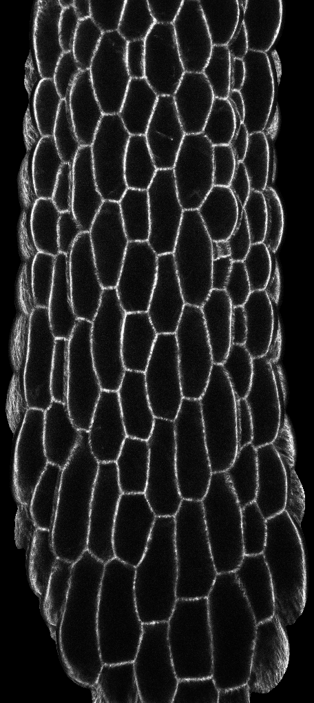
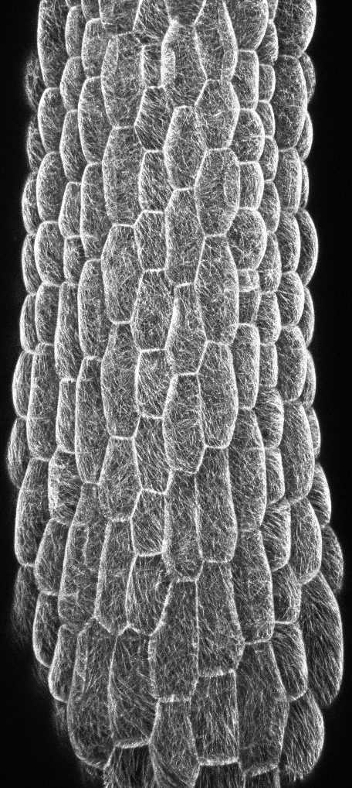
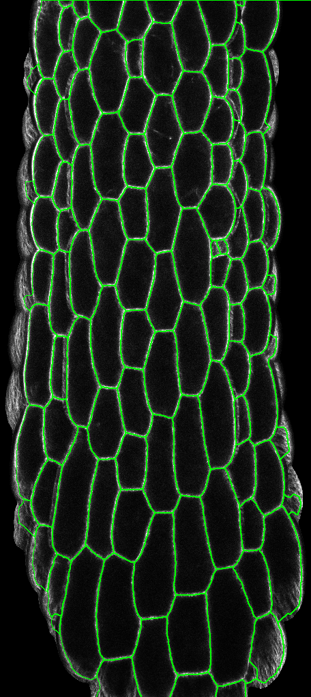

# PlantCellSeg-ImageJ

A modular and practical **ImageJ/Fiji pipeline** for segmenting *plant epidermal cells* from 3D confocal microscopy images.  
This workflow includes **optional preprocessing with SurfCut** to better handle curved tissues such as leaves, and uses **MorphoLibJ** for morphological segmentation.

---
 

---

## 📌 Features

- 🔬 Designed for **plant epidermal tissue** (e.g., leaf surface)  
- 🧼 **SurfCut support (optional)** for surface flattening  
- 🧠 Morphological segmentation using **MorphoLibJ**  
- 📏 ROI extraction for quantitative shape analysis  
- 🔁 ImageJ macro-based, reproducible and extensible

---

### 🧬 What does SurfCut do?

SurfCut extracts the outermost cell layer from a 3D confocal stack by detecting the surface, cropping a user-defined depth, and projecting it into a single 2D image.

> 📌 *Illustration from the [SurfCut GitHub repository](https://github.com/sverger/SurfCut), used here for educational purposes.*

---
## 🧪 Pipeline Overview

The pipeline processes 3D confocal image stacks of plant tissues with flexible preprocessing options.

## 🧪 Processing Steps / 處理流程

### 1. **Preprocessing (choose one) **

| 選項              | 說明 (English)                                                              | 說明 (中文)                                                         |
|-------------------|-----------------------------------------------------------------------------|----------------------------------------------------------------------|
| **SurfCut2 Lite** | Extracts a surface layer from 3D stack; ideal for curved tissues.          | 從 3D 堆疊中擷取表面層，適合彎曲葉片或曲面樣本。                      |
| **Max Projection**| Projects Z-stack using maximum intensity; best for flat tissues.           | 將 Z 軸投影為最大強度影像，適合平坦或已壓平的樣本。                  |
| **None**          | Directly segments the current slice; for 2D or preprocessed images.        | 直接對目前影像分割，適用於 2D 或已預處理的影像。                     |

---

### 📌 Usage Tips / 使用建議

- 🌿 若葉片**彎曲嚴重**（如自然捲曲或呈弧形）：建議使用 **SurfCut2 Lite**
- 📄 若葉片**平坦或已壓平**：建議使用 **Max Projection**
- 🖼️ 若影像是**單張 2D** 或**已投影處理過的圖像**：可選擇 **None**

---

### 2. **Denoising 

- Applies *Despeckle* filter and *Gaussian blur* for noise reduction.  

### 3. **Segmentation 

- Uses **MorphoLibJ**’s automatic watershed segmentation 

### 4. **ROI Extraction 

- Converts segmented label map into vector-based ROIs.  

---

💡 **Tip**  
Upon starting the macro, a dropdown menu will prompt you to choose the preprocessing method, ensuring the pipeline is tailored to your image type.  

---

## Comparison between SurfCut and SurfCut2 Lite

This project integrates [SurfCut2 Lite](https://github.com/VergerLab/SurfCut2) as a preprocessing step to efficiently and automatically extract the epidermal layer signal from 3D confocal stacks.

### Why choose SurfCut2 Lite?

- **Original SurfCut** [SurfCut](https://github.com/sverger/SurfCut)
  Offers full parameter options and an interactive interface, suitable for in-depth exploration of surface extraction principles and parameter tuning. It is a valuable tool for academic research and method development.

- **SurfCut2 Lite**  
  A lightweight, interface-free version designed for seamless integration into automated ImageJ macro workflows. It greatly saves processing time and improves reproducibility, making it ideal for routine large-scale data analysis.

### Recommendations

- If you need flexible parameter adjustments and want to deeply understand the projection mechanism, the original SurfCut is recommended.  
- If you prioritize speed, automation, and workflow stability, SurfCut2 Lite is preferred.

---
  

## 📁 Requirements

- Fiji (ImageJ) with the following plugins installed:
  - [MorphoLibJ](https://imagej.net/plugins/morpholibj)  
  - [SurfCut2 Lite](https://github.com/VergerLab/SurfCut2) — **Included in this pipeline**  
    SurfCut2 Lite is a macro for extracting a surface layer from 3D image stacks,  
    especially suited for curved or dome-shaped tissues.  
    This macro is integrated into the pipeline and requires no separate download or installation.

---
### 🔍 About Cutting Depth Parameters (Top / Bottom)

The `Top` and `Bottom` values in SurfCut2 Lite do **not** correspond to the original Z-stack slice indices.

Instead, they define the **relative depth** from the detected surface, after the edge-projection process. Internally, SurfCut generates a surface-aligned mask and shifts it along Z to extract a target layer.

Use integers (in slices), e.g., Top = 10, Bottom = 12, to extract the cell layer approximately 10–12 slices below the curved surface.

🧠 These slices are in a synthetic projected space, not physical microns or raw Z indices.

---

## 🔍 Example Segmentation Result (Max Projection)

This segmentation result was generated using the **Max Projection** preprocessing method:

🧩 **Segmentation Output (Max Projection)**  

File: `20160406 3Gp L2 1.tif` 📂 [Download Example: 20160406 3Gp L2 1.tif](https://github.com/<username>/<repo>/releases/download/v1.0/20160406%203Gp%20L2%201.tif)  

> 📌 *The Max Projection method is suitable for relatively flat samples or flattened leaf tissue. It may result in blurred boundaries on curved samples.*

## 🧪 SurfCut Result Comparison

File: `Hypocotyl_GFP-MBD.tif` 📂 [Download Example: Hypocotyl_GFP-MBD.tif](https://github.com/<username>/<repo>/releases/download/v1.0/Hypocotyl_GFP-MBD.tif)

**Left:** SurfCut projection  
**Middle:** Original max projection  
**Right:** Segmentation result after SurfCut

> ⚙️ *SurfCut settings used:*
> - Blur radius: `3`  
> - Threshold: `15`  
> - Top cut: `9`  
> - Bottom cut: `11`

> 📷 **Image source (Hypocotyl sample):** kindly provided by the authors of [SurfCut](https://github.com/sverger/SurfCut)  
 
---

## 📖 References

- Verger, S., et al. (2019). SurfCut: A macro tool for surface layer extraction from 3D images. *BMC Biology*, 17, 32.  
  [https://doi.org/10.1186/s12915-019-0657-1](https://doi.org/10.1186/s12915-019-0657-1)

- Legland, D., Arganda-Carreras, I., & Andrey, P. (2016). MorphoLibJ: integrated library and plugins for mathematical morphology with ImageJ. *Bioinformatics*, 32(22), 3532–3534.  
  [https://doi.org/10.1093/bioinformatics/btw413](https://doi.org/10.1093/bioinformatics/btw413)

- Fiji / ImageJ Documentation:  
  [https://imagej.net/](https://imagej.net/)

- SurfCut2 Lite macro:  
  [https://github.com/VergerLab/SurfCut2](https://github.com/VergerLab/SurfCut2)

---

## 📬 License & Acknowledgements

- This pipeline optionally uses [SurfCut](https://github.com/sverger/SurfCut), which remains under its original license.  
- MorphoLibJ is maintained by the INRAE image processing team.  
- This pipeline is intended for academic and research use.
- The hypocotyl sample image used in the SurfCut segmentation comparison was generously provided by the authors of the SurfCut project.
  
